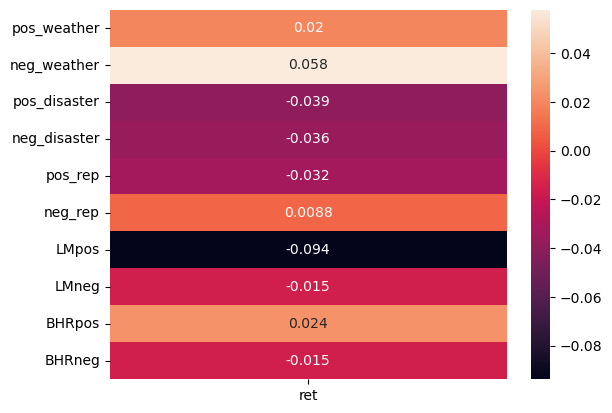
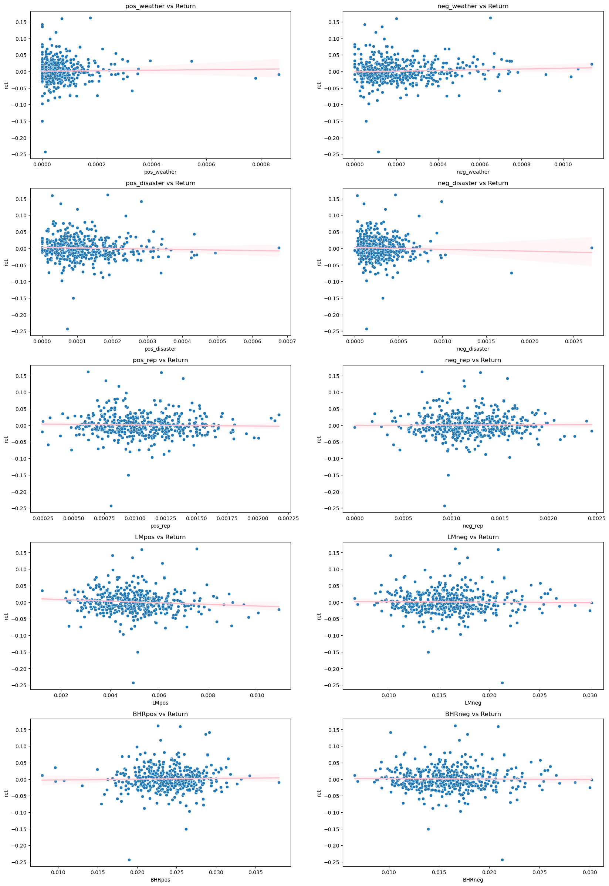

# Project Summary

### Purpose
The purpose of this assignment is to better understand how sentiment within a 10-K effects the stock return around the release of the 10-K. In a high-level overview, we accomplished this by measuring the sentiment scores of the 10-Ks against multiple dictionaries to indicate if the 10-K had a more positive or negative sentiment. We then evaluated the correlation between each sentiment dictionary and the return. In the end, I found no significant correlation between my sentiment dictionaries and stock returns on the filing date.

### Process
To accomplish this task, we took the following steps:
1. Extracted the list of firms listed on the S&P 500 from the S&P 500 page on wikipedia
2. Downloaded 10-K files from the SEC website during the year 2022
3. Loaded five sentiment dictionaries
4. Looped over the sample list to add accession number, filing date, positive sentiment scores per dictionary, and  negative sentiment scores per dictionary
5. Downloaded list of returns for each stock in 2022
6. Merged sample list with returns list by ticker, filing date, and return date
7. Evaluated correlation per sentiment dictionary in both positive and negative by return

# The Data

### The Sample
Our sample is the list of stocks listed on the S&P 500 from December 28, 2022. Our total sample size is 503.

### Return Variables
To find the return variables, we used the following steps:
1. Import urlopen from the rllib.request library
2. Import BytesIO from the io library
3. Copy the "crsp_2022_only.zip" file URL from the Stock Returns (CRSP) folder
4. Use the following code to read the zip file and create a varaible to save the data

```python
url = 'https://github.com/LeDataSciFi/data/blob/main/Stock%20Returns%20(CRSP)/crsp_2022_only.zip?raw=true'

with urlopen(url) as request:
    data = BytesIO(request.read())

with ZipFile(data) as archive:
    with archive.open(archive.namelist()[0]) as stata:
        returns = pd.read_stata(stata)
```

This saved dataset includes daily returns for each stock for 2022. For my analysis, I only want returns for the filing date of the 10-K. To do this I used a left merge on the S&P 500 data where ticker symbol matched and the return date matched the filing date. 

To create a more comprehensive analysis, it's best to look at the return data on the day of the 10-K filing and at return data on days surrounding the filing date.

### Sentiment Variables
To create our sentiment variables, we used five sentiment dictionaries. Two of these libraries were given to us and the other three we created ourselves. The two dictionaries given to us were the LM sentiment dictionary from researchers Loughran and McDonald and the ML sentiment dictionary from the Journal of Financial Economics. 

To create the sentiment variables, we used the following steps:
1. Read the CSV files of the LM dictionary
2. Divide the LM dictionary into a positive and negative by creating a list of positive words where the positive column is greater than zero and a list of negative words where the negative column is greater than zero
3. Load the ML negative dictionary text file
4. Load the ML positive dictionary text file
5. Create text files of our sentiment dictionaries, ensuring various uses of relevant words are included (ie. -s, -ed, etc.)
6. Load the text files of the personalized sentiment dictionaries
7. For consistency, make all dictionaries lower case
8. Use len() to find the length of the document
9. Use NEAR_finder() to create positive and negative sentiment scores for each personalized dictionary
10. Divide the NEAR_finder() value by the document length to get the sentiment score. Here is an example of this code
```python
sp500.loc[index,'pos_rep'] = NEAR_finder(reputation, BHR_positive,document)[0]/doc_length
```
11. To compute sentiment scores for the LM and ML dictionaries, use the findall() function and divide by the document length. Here is an example of this code
```python
LM_pos = r'\b('+'|'.join(LM_positive)+r')\b'
sp500.loc[index, 'LMpos'] = len(re.findall(LM_pos, document))/doc_length
```

### LM and ML Dictionary Statistics
| Dictionary | Word Count |
| --- | --- |
| LM Positive | 347 |
| LM Negative | 2345 |
| ML Positive | 75 |
| ML Negative | 94 |

### Contextual Sentiments

For my contextual sentiment measures, I chose weather, natural disasters, and reputation. I chose these topics because I was particularly interested in how, if at all, these topics influence the overall sentiment of a 10-K.

### Summary Statistics

Using .describe(), I can see that the mean and standard deviation of my sentiment scores and the returns are not zero. This is significant because it indicates there is variability in the data. Please see the summary statistics for each sentiment score and the returns below.

### Passing the Smell Test

I do believe my contextual measures pass the "smell" test. I have variation in my measurements and many scores which were not zero. With that being said, refining the contextual sentiment dictionaries could help strengthen these results and further improve the analysis, resulting in overall less zeros in sentiment scores for individual stocks.


```python
# Summary statistics of the sentiment scores and returns
import numpy as np
import pandas as pd
import csv
data = pd.read_csv('output/analysis_sample.csv')
data[['pos_weather', 'neg_weather', 'pos_disaster', 'neg_disaster', 'pos_rep', 'neg_rep', 'LMpos', 'LMneg',
    'BHRpos', 'BHRneg', 'ret']].describe()
```


<div>
<style scoped>
    .dataframe tbody tr th:only-of-type {
        vertical-align: middle;
    }

    .dataframe tbody tr th {
        vertical-align: top;
    }

    .dataframe thead th {
        text-align: right;
    }
</style>
<table border="1" class="dataframe">
  <thead>
    <tr style="text-align: right;">
      <th></th>
      <th>pos_weather</th>
      <th>neg_weather</th>
      <th>pos_disaster</th>
      <th>neg_disaster</th>
      <th>pos_rep</th>
      <th>neg_rep</th>
      <th>LMpos</th>
      <th>LMneg</th>
      <th>BHRpos</th>
      <th>BHRneg</th>
      <th>ret</th>
    </tr>
  </thead>
  <tbody>
    <tr>
      <th>count</th>
      <td>501.000000</td>
      <td>501.000000</td>
      <td>501.000000</td>
      <td>501.000000</td>
      <td>501.000000</td>
      <td>501.000000</td>
      <td>501.000000</td>
      <td>501.000000</td>
      <td>501.000000</td>
      <td>501.000000</td>
      <td>492.000000</td>
    </tr>
    <tr>
      <th>mean</th>
      <td>0.000065</td>
      <td>0.000215</td>
      <td>0.000117</td>
      <td>0.000287</td>
      <td>0.001059</td>
      <td>0.001183</td>
      <td>0.004986</td>
      <td>0.015906</td>
      <td>0.023948</td>
      <td>0.015906</td>
      <td>0.000911</td>
    </tr>
    <tr>
      <th>std</th>
      <td>0.000084</td>
      <td>0.000182</td>
      <td>0.000086</td>
      <td>0.000220</td>
      <td>0.000316</td>
      <td>0.000357</td>
      <td>0.001315</td>
      <td>0.003691</td>
      <td>0.003489</td>
      <td>0.003691</td>
      <td>0.034349</td>
    </tr>
    <tr>
      <th>min</th>
      <td>0.000000</td>
      <td>0.000000</td>
      <td>0.000000</td>
      <td>0.000000</td>
      <td>0.000244</td>
      <td>0.000000</td>
      <td>0.001226</td>
      <td>0.006609</td>
      <td>0.007966</td>
      <td>0.006609</td>
      <td>-0.242779</td>
    </tr>
    <tr>
      <th>25%</th>
      <td>0.000017</td>
      <td>0.000085</td>
      <td>0.000057</td>
      <td>0.000150</td>
      <td>0.000835</td>
      <td>0.000945</td>
      <td>0.004095</td>
      <td>0.013296</td>
      <td>0.021971</td>
      <td>0.013296</td>
      <td>-0.016449</td>
    </tr>
    <tr>
      <th>50%</th>
      <td>0.000042</td>
      <td>0.000168</td>
      <td>0.000097</td>
      <td>0.000242</td>
      <td>0.001020</td>
      <td>0.001174</td>
      <td>0.004895</td>
      <td>0.015646</td>
      <td>0.024117</td>
      <td>0.015646</td>
      <td>-0.001360</td>
    </tr>
    <tr>
      <th>75%</th>
      <td>0.000085</td>
      <td>0.000295</td>
      <td>0.000155</td>
      <td>0.000376</td>
      <td>0.001263</td>
      <td>0.001414</td>
      <td>0.005656</td>
      <td>0.017859</td>
      <td>0.026129</td>
      <td>0.017859</td>
      <td>0.015979</td>
    </tr>
    <tr>
      <th>max</th>
      <td>0.000866</td>
      <td>0.001137</td>
      <td>0.000676</td>
      <td>0.002705</td>
      <td>0.002172</td>
      <td>0.002449</td>
      <td>0.010899</td>
      <td>0.030185</td>
      <td>0.037982</td>
      <td>0.030185</td>
      <td>0.162141</td>
    </tr>
  </tbody>
</table>
</div>


# Results


```python
# Correlation between each sentiment measure and the return

import matplotlib.pyplot as plt
import seaborn as sns
corr_table = data[['pos_weather', 'neg_weather', 'pos_disaster', 'neg_disaster', 'pos_rep', 'neg_rep', 'LMpos', 'LMneg', 'BHRpos', 'BHRneg', 'ret']].corr()
corr_table = corr_table.loc[['pos_weather', 'neg_weather', 'pos_disaster', 'neg_disaster', 
                             'pos_rep', 'neg_rep', 'LMpos', 'LMneg', 'BHRpos', 'BHRneg',], ['ret']]

print(corr_table)

print(sns.heatmap(corr_table, annot=True))
```

                       ret
    pos_weather   0.019569
    neg_weather   0.057847
    pos_disaster -0.039282
    neg_disaster -0.036025
    pos_rep      -0.032220
    neg_rep       0.008762
    LMpos        -0.093838
    LMneg        -0.015421
    BHRpos        0.023518
    BHRneg       -0.015421
    Axes(0.125,0.11;0.62x0.77)


    

    


```python
# Scatterplot of each sentiment measure vs return with regression lines

sent = ['pos_weather', 'neg_weather', 'pos_disaster', 'neg_disaster', 
             'pos_rep', 'neg_rep', 'LMpos', 'LMneg', 'BHRpos', 'BHRneg']

fig, axes = plt.subplots(5, 2, figsize=(20, 30))

axes = axes.flatten()

for i, sent in enumerate(sent):
    sns.scatterplot(data=data, x=sent, y='ret', ax=axes[i])
    sns.regplot(data=data, x=sent, y='ret', ax=axes[i], scatter = False, color = 'pink')
    axes[i].set_title(f"{sent} vs Return")
```


    

    


# Let's Explore the Results

### Return Variables and LM Sentiment vs Return Variables and ML Sentiment

The return variable on the filing date has a negative correlation with LM positive, LM negative, and ML negative dictionaries. The return variable on the filing date has a positive correlation with ML positive. Additionally, LM positive has the greatest magnitude of correlation while LM negative and ML negative share the same correlation. 

### Garcia, Hu, and Rohrer Paper Results

My results were slightly different than the results in the Garcia, Hu, and Rohrer paper. This is likely because of a difference in the number of firms observed and controls in place that Garcia, Hu, and Rohrer used compared to us. This was likely because they wanted more data points to perform analysis on to produce more reliable results. My magnitude dispersion was generally the same, as were my signs.

### Contextual Sentiment Measures

My three contextual sentiment measures do look different enough from zero that more investigation can be done. This is likely because my sentiment measures can have direct result on firm performance which may effect stock return. Refining these sentiment dictionaries would lead to more accurate results.

### ML Returns

ML positive has a higher magnitude in correlation to returns compared to ML negative. ML negative is negative while ML positive is positive in signs.
